## 💼 What I'm doing right now

**Software Engineering Intern @ Pulse** 

Working across two parallel workstreams on Pulse's backend and cloud pipeline. I write pytest integration and orchestration tests covering health checks, validation, and processing flows, and I've been deep in the weeds of CI — debugging branch and environment mismatches, fixing pre-existing failures, and isolating dependencies into clean virtual environments so 50+ tests run reliably.

**Software Engineering Intern @ Pennsylvania Horticultural Society** 

Helping migrate a 1,000+ page website from Apostrophe CMS to WordPress. I rewrite and restructure content from cross-departmental audits, build event pages with semantic HTML, and engineered a Python + Playwright automation pipeline that batch-exports 2,500+ pages as PDFs — replacing what would have been weeks of manual clicking.

**Student @ Bryn Mawr College** — CS major with an AB/MA in Mathematics, class of 2028.

---

Outside of work: cricket and badminton 🏸, an ongoing search for Philly's best boba 🧋, and a reading list that keeps growing faster than I can finish it 📚
